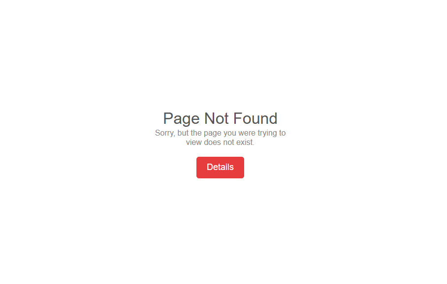

<div align="center">

# 🚀 Finix Landing Page

<p>
A modern, responsive, and clean <b>Finix Landing Page</b> built using
<b>HTML5</b>, <b>CSS3</b>, and <b>Bootstrap 5</b>.
</p>


</div>

---

# 📖 About The Project

This project is a fully responsive **Finix Landing Page** created only for frontend design practice.

The design is built using:

- HTML5
- CSS3
- Bootstrap 5

This project focuses on creating a modern UI with responsive layouts and clean code.

---

# ✨ Features

✅ Fully Responsive Design

✅ Modern User Interface

✅ Bootstrap 5 Components

✅ Clean HTML Structure

✅ Organized CSS

✅ Mobile Friendly

✅ Easy to Customize

---

# 🛠️ Built With

| Technology | Description |
|------------|-------------|
| HTML5 | Page Structure |
| CSS3 | Custom Styling |
| JavaScript | Dynamic System |
| Bootstrap 5 | Responsive Framework |

---

# 📂 Folder Structure

```text
Finix-Landing-Page/
│
├── css/
│   └── responsive.css
│   └── style.css
├── img/
│   └── .gitkeep
│   └── image.png
├── js/
│   └── app.js
├── index.html
├── 404.html
└── README.md
```

---

# 🚀 Live Demo

> Replace the link below with your own deployment.

```text
https://iamdeveloperrayhan.github.io/finix-landing-page/
```

or

<a href="https://iamdeveloperrayhan.github.io/finix-landing-page/" target="_blank">

</a>

---

# 📸 Project Screenshot


Replace the image below.


# ⚙️ Installation

Clone the repository

```bash
git clone https://github.com/iamdeveloperrayhan/finix-landing-page.git
```

Go to project folder

```bash
cd finix-landing-page
```

Open

```text
index.html
```

or use VS Code Live Server.

---

# 📋 Requirements

- Modern Browser
- VS Code (Recommended)
- Live Server Extension (Optional)

---

# 🎨 Customization

You can easily customize:

- Colors
- Fonts
- Images
- Sections
- Buttons
- Icons
- Bootstrap Components

---

# 📱 Responsive

Tested On

- Desktop ✅
- Laptop ✅
- Tablet ✅
- Mobile ✅

---

# 👨‍💻 Author

**Name**

```text
Developer Rayhan
```

**GitHub**

```text
https://github.com/iamdeveloperrayhan
```


**Facebook**

```text
https://facebook.com/iamdeveloperrayhan
```

**LinkedIn**

```text
https://linkedin.com/in/iamdeveloperrayhan
```

---

# 📬 Contact

Email

```text
iamdeveloperrayhan@gmail.com
```

---

# ⭐ Support

If you like this project, don't forget to give it a ⭐ on GitHub.

---

# 📄 License

This project is licensed under the **MIT License**.

---

<div align="center">

### ❤️ Thank You For Visiting

Made with ❤️ by **Developer Rayhan**

</div>
